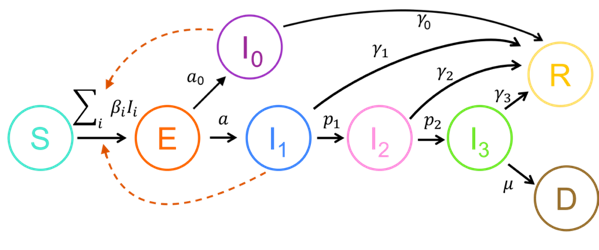
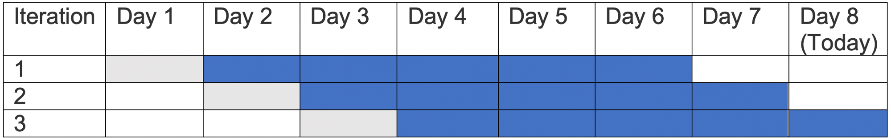
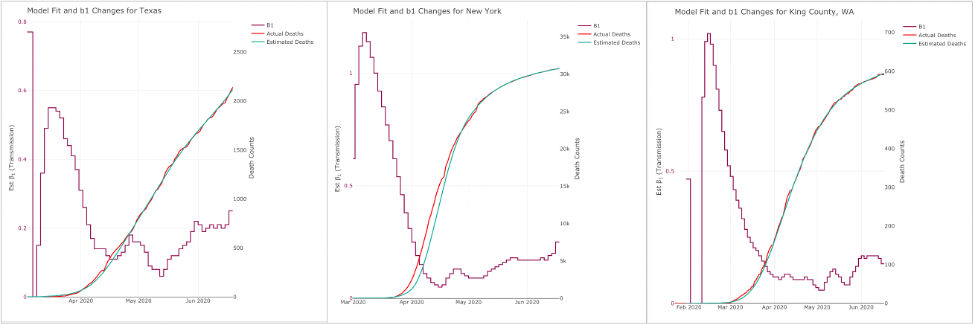
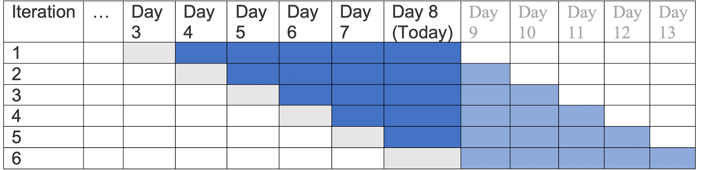
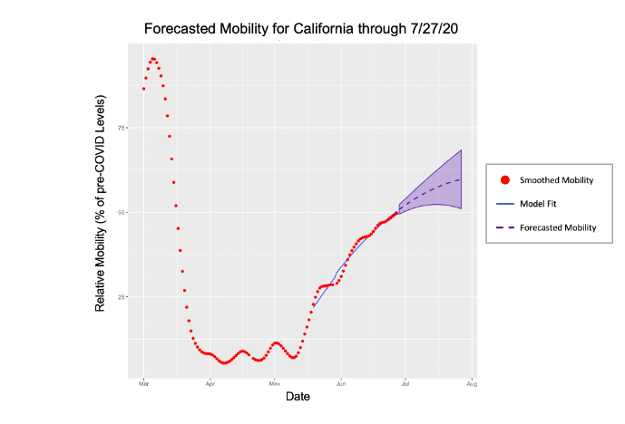
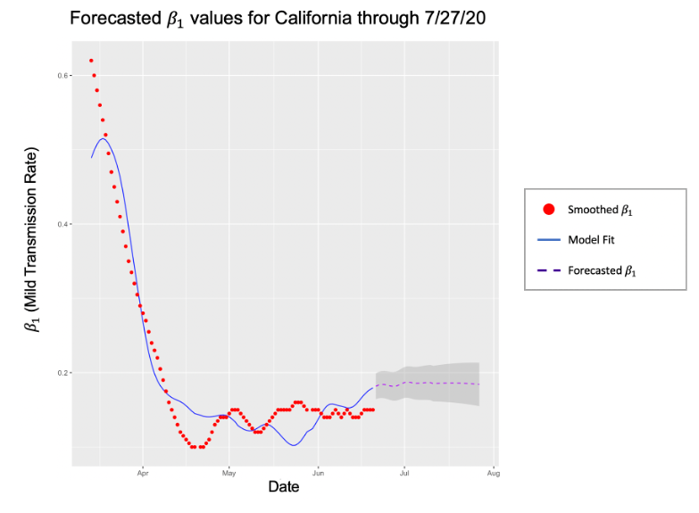
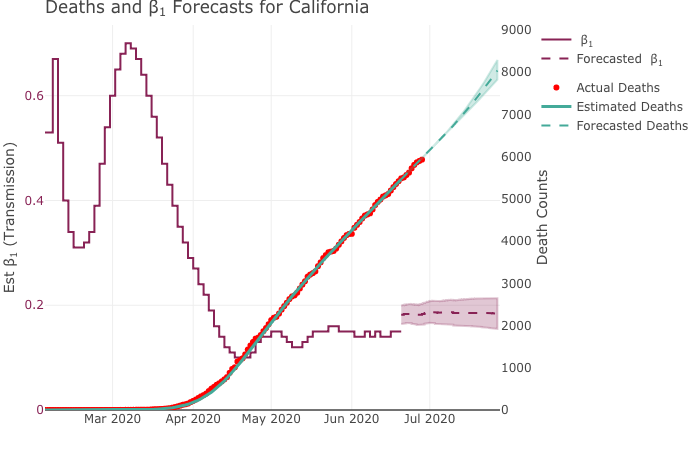
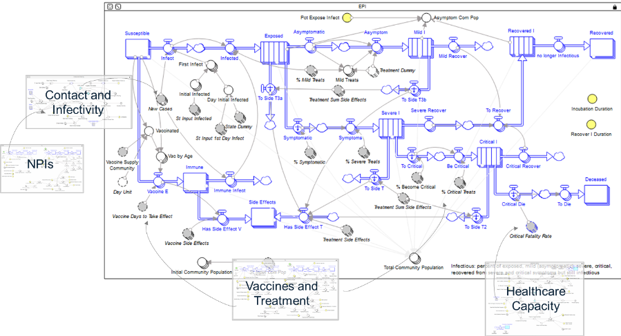

## Intervention Model Description
  
  
  

We use a compartmental epidemiological model based on the classic SEIR model to describe the spread and clinical progression of COVID-19. Our model extends [existing intervention model](https://alhill.shinyapps.io/COVID19seir/) created by Alison Hill of Harvard University and licensed under a [Creative Commons Attribution-ShareAlike 4.0 International (CC BY-SA 4.0) License](https://creativecommons.org/licenses/by-sa/4.0/).

It is important to track the different clinical outcomes of infection, since they require different level of healthcare resources to care for and may be tested and isolated at different rates. Susceptible ($S$) individuals who become infected start out in an exposed class $E$, where they are asymptomatic and do not transmit infection. The rate of progressing from the exposed stage to the infected stage $I$, where the individual is symptomatic and infectious, occurs at rate $a$. The clinical descriptions of the different stages of infection are given below. Infected individuals begin with *mild* infection ($I_1$), from which they either recover, at rate $\gamma_1$, or progress to *severe* infection ($I_2$), at rate $p_1$. Severe infection resolves at rate $\gamma_2$ or progresses to a critical stage ($I_3$) at rate $p_2$. $p_2$ is further adjusted in response to hospital bed capacity being reached. Individuals with critical infection recover at rate $\gamma_3$ and die at rate $\mu$. $\mu$ is further adjusted in response to hospital ventilator capacity being reached. Recovered individuals are tracked by class $R$ and are assumed to be protected from re-infection for life. Individuals may transmit the infection at any stage, though with different rates. The  transmission rate in stage $i$ is described by $\beta_i$ . A new subpopulation for *asymptomatic* infections  ($I_0$) has been added, that only has a recovery rate ($\gamma_0$) and no progression, but can infect anyone via transmission rate $\beta_0$. This will allow modeling of a recently identified group that may explaqin why COVID-19 seems so contagious (see https://www.sciencemag.org/news/2020/03/cellphone-tracking-could-help-stem-spread-coronavirus-privacy-price).

### Equations

\begin{equation}
\dot{S} = -\beta_1 I_1 S -\beta_2 I_2 S - \beta_3 I_3 S
\end{equation}

\begin{equation}
\dot{E} =\beta_1 I_1 S +\beta_2 I_2 S + \beta_3 I_3 S - (a + a_0) E \\
\end{equation}

\begin{equation}
\dot{I_0} = a_0 E - \gamma_0 I_0 \\
\end{equation}

\begin{equation}
\dot{I_1} = a E - \gamma_1 I_1 - p_1 I_1 \\
\end{equation}

\begin{equation}
p _ \texttt{2\_hc} = p_2 + \dfrac{pmax_2 - p_2}{1 + (\frac{hc}{I_2 + \epsilon}) ^ m  } \\
\end{equation}

\begin{equation}
\dot{I_2} = p_1 I_1 -\gamma_2 I_2 - p _ \texttt{2\_hc} I_2 \\
\end{equation}

\begin{equation}
\mu_{vc} = \dfrac{\mu}{abs(1 - (\frac{I_3}{vc}) ^ m) + \epsilon} \\
\end{equation}

\begin{equation}
\dot{I_3} = p _ \texttt{2\_hc} I_2 - \gamma_3 I_3 - \mu _ {vc} I_3 \\
\end{equation}

\begin{equation}
\dot{R} = \gamma_1 I_1 + \gamma_2 I_2 + \gamma_3 I_3 \\
\end{equation}

\begin{equation}
\dot{D}  = \mu_{vc} I_3 \\
\end{equation}

### Variables
* $S$: Susceptible individuals
* $E$: Exposed individuals - infected but not yet infectious or symptomatic
* $I_i$: Infected individuals in severity class $i$. Severity increaes with $i$ and we assume individuals must pass through all previous classes
* $I_0$: Asymptomatic infection 
* $I_1$: Mild infection 
* $I_2$: Severe infection 
* $I_3$: Critical infection 
* $R$: individuals who have recovered from disease and are now immune
* $D$: Dead individuals
* $N=S+E+I_1+I_2+I_3+R+D$ Total population size (constant)

### Rate Parameters
* $\beta_i$ rate at which infected individuals in class $I_i$ contact susceptibles and infect them
* $\beta_0 = \beta_1 * AsymptoCrossSect$ infection rate for asymptomatics scaled relative to $\beta_1$
  * $a$ rate of progression from the exposed to infected class
* $a_0$ rate of progression from the exposed to asymptomatic (hidden) infected class
* $\gamma_i$ rate at which infected individuals in class $I_i$ recover from disease and become immune
* $p_i$ rate at which infected individuals in class $I_i$ progress to class $I_{i+1}$
  * $p _ \texttt{2\_hc}$ adjusted $p_2$ by hospital bed capacity
* $\mu$ death rate for individuals in the most severe stage of disease
* $\mu _ {vc}$ adjusted $\mu$ by ventilator capacity
* $m$ cutoff steepness for saturatible hospital capacities

### Hospital Parameters
* $hc$ number of hospital beds per 1000 ppl
* $ic$ number of ICU beds per 1000 ppl
* $vc$ number of (combined) ventilators per 1000 ppl

### Clinical stages

* Mild infection - These individuals have symptoms like fever and cough and may have mild pneumonia.  Hospitalization is not required (though in many countries such individuals are also hospitalized)
* Severe infection - These individuals have more severe pneumonia that leads to dyspnea, respiratory frequency <30/min, blood oxygen saturation <93%, partial pressure of arterial oxygen to fraction of inspired oxygen ratio <300, and/or lung infiltrates >50% within 24 to 48 hours. Hospitalization and supplemental oxygen are generally required.
* Critical infection - These individuals experience respiratory failure, septic shock, and/or multiple organ dysfunction or failure. Treatment in an ICU, often with mechanical ventilation, is required.

### Relating clinical observations to model parameters

To determine the model parameters consistent with current clinical data, we collect the following values from the slider values chosen by the user, and then use the formulas below to relate them to the rate parameters in the model. Note that the slider inputs for time intervals are averages durations. 

* IncubPeriod:  Average incubation period, days
* FracAsympto:  % of asymptomatic patients out of first-stage infected-cases
* AsymptoCrossSect: effective scaling of infection rate for asymptomatics relative to $\beta_1$
  * DurMildInf: Average duration of mild infections, days
* FracMild: Average fraction of (symptomatic) infections that are mild
* FracSevere: Average fraction of (symptomatic) infections that are severe
* FracCritical: Average fraction of (symptomatic) infections that are critical
* CFR: Case fatality rate (fraction of infections that eventually result in death)
* DurHosp: Average duration of hospitalization for individuals with severe/critical infection, days
* TimeICUDeath: Average time from ICU admission to death, days

\begin{equation}
a = \frac{1}{IncubPeriod}
\end{equation}

<!-- #g1=(1/DurMildInf)*FracMild -->
  \begin{equation}
\gamma_1 = \frac{1}{DurMildInf} * FracMild
\end{equation}

<!-- #p1=(1/DurMildInf)-g1 -->
  \begin{equation}
p_1 = \frac{1}{DurMildInf} - \gamma_1
\end{equation}

<!-- #p2=(1/DurHosp)*(FracCritical/(FracSevere+FracCritical)) -->
  \begin{equation}
p_2 = \frac{1}{DurHosp} * \frac{FracCritical}{(FracSevere+FracCritical)}
\end{equation}

<!-- #g2=(1/DurHosp)-p2 -->
  \begin{equation}
\gamma_2 = \frac{1}{DurHosp} - p_2
\end{equation}

<!-- #u=(1/TimeICUDeath)*(CFR/FracCritical) -->
  \begin{equation}
u = \frac{1}{TimeICUDeath} * \frac{CFR}{FracCritical}
\end{equation}

<!-- #g3=(1/TimeICUDeath)-u -->
  \begin{equation}
\gamma_3 = \frac{1}{TimeICUDeath} - u
\end{equation}

### Basic reproductive ratio

Idea: $R_0$ is the sum of 
1. the average number of secondary infections generated from an individual in stage $I_1$
  2. the probability that an infected individual progresses to $I_2$ multiplied by the average number of secondary infections generated from an individual in stage $I_2$
  3.  the probability that an infected individual progresses to $I_3$ multiplied by the average number of secondary infections generated from an individual in stage $I_3$
  
  \begin{equation}
R_0  = N\frac{\beta_1}{p_1+\gamma_1} + N\frac{\beta_0}{\gamma_0} + \frac{p_1}{p_1 + \gamma_1} \left( \frac{N \beta_2}{p _ \texttt{2\_hc}+\gamma_2} + \frac{p _ \texttt{2\_hc}}{p _ \texttt{2\_hc} + \gamma_2} \frac{N \beta_3}{\mu _ {vc} + \gamma_3}\right)
\end{equation}

\begin{equation}
= N\left( \frac{\beta_0}{\gamma_0} + \frac{\beta_1}{p_1+\gamma_1} \left(1 + \frac{p_1}{p _ \texttt{2\_hc} + \gamma_2}\frac{\beta_2}{\beta_1} \left( 1 + \frac{p _ \texttt{2\_hc}}{\mu _ {vc} + \gamma_3} \frac{\beta_3}{\beta_2} \right) \right) \right)
\end{equation}

Calculations using the next generation matrix give the same results. 

### Early epidemic growth rate

Early in the epidemic, before susceptibles are depleted, the epidemic grows at an exponential rate $r$, which can also be described with doubling time T$_2$=ln(2)$/r$. During this phase all infected classes grow at the same rate.

### Assumptions

* This model is formulated as a system of differential equations and the output therefore represents the expected values of each quantity. It does not take into account stochastic events or report the expected variance in the variables, which can be large. 
* Individuals must pass through a mild stage before reaching a severe or critical stage
* Individuals must pass through a severe stage before reaching a critical stage
* Only individuals in a critical stage die
* Asymptomatic individuals do not progress further and can only be identified using PCR or antibody testing

---

## SEIR Model Tuning

Our SEIR models are fit to a given region’s (state or county) cumulative death curve of a using a sliding window algorithm. In short, the model is fit in small chunks (or steps) by adjusting the symptomatic transmission rate $\beta_1$ over time to match expected death counts. Specifically, the fitting process is governed by two hyperparameters: the step-size (number of days to fit at a time) and the window-size (number of days to look ahead while fitting the current transmission rate). At each step, the objective is to find the transmission rate that minimizes the difference between the projected and actual deaths for the current time window. The time-step and window then move forward one day and the process is repeated (see the figure below). 

The above example assumes we have 8 days of death counts, a step-size of 1, and a window-size of 5. For the first iteration, the transmission rate for Day 1 is fit using death counts from Days 2-6. In iteration 2, the transmission rate for Day 2 is fit using death counts from Days 3-7. Finally, the transmission rate for Day 3 is fit using death counts from Days 4-8. 

While this example assumes a window-size of 5, our models, in reality, need a much larger window to accurately predict the transmission rate. This is because deaths are a lagging indicator of transmission – it usually takes 2-3 weeks for changes in transmission rates to affect the death rate. Pinning down a ‘one-size fits all’ window size proved to be quite challenging - if the window-size is too small, the curve will over-fit local fluctuations; too large, and it will underfit the curve. We found from experience that a window size of 20 yielded the best overall fits. A few examples are highlighted in Figure 2: 

A consequence of using a forward-looking window is that we can only fit the transmission rate up the beginning of the last window without adjusting the algorithm. In other words, if the window size is $w$, we can only make inferences about the transmission rate w days ago. This is especially problematic, because stakeholders are often concerned with the current transmission rate as opposed to its value a few weeks ago. As such, we investigated ways to minimize the gap as much as possible. 

We considered two approaches for dealing with this issue. The first is to project case counts for the next $w$ days and train the model on these predictions (Shown in **Figure 3**). In this case, we estimate the last w days of transmission rates of data using a combination of true death counts and _projected_ death counts as we progress through the window. Each successive estimate leans more and more on projections until day 8, when the estimate is made based entirely on future projections. 

While this approach allows you to estimate today’s transmission rate, it suffers from one main drawback: training one model on another model’s projections introduces substantial uncertainty. If the projections are off, so too will transmission rate estimates. 

The second approach we considered was to simply shrink the window size as the algorithm moves through the final window. If fully executed, this strategy allows you to estimate the transmission rate up the second to last day of the window (Day 7 in this example). However, as the window size decreases, so too do does the accuracy of the transmission rate estimate; if the window size is too small, the algorithm will often overfit to short-term fluctuations and fail to capture the long-term shape of the death curve. However, we found empirically that this effect doesn’t materialize until about the last week of data. Ultimately, we settled on a version of this approach that terminates once the fitting procedure reaches the last 8 days of data.

All SEIR models, including our mobility-based and policy-based models, were fit using this algorithm. The transmission rate was then forecasted for the last 8 days of data and beyond using different approaches explained below.  

---

## Forecasting

### Ensemble Model

Our ensemble model projects future cases, deaths and hospitalizations for a given state or county by averaging predictions from three smaller models: a **policy-based SEIR model**, a **mobility-based SEIR model**, and a **statistical curve-fitting model**. Both SEIR models share the same underlying structure and fits up to the last 8 days of data. Both attempt to estimate future transmission rates, and these estimates are used to generate case, death, and hospitalization forecasts. However, they differ in how they forecast future transmission rates. The policy-based model attempts to estimate transmission by using information around the timing of non-pharmaceutical interventions (NPIs), while the mobility model uses trends in a region’s mobility to estimate the transmission rate.

In contrast, the statistical model uses a weighted average of three classical curve-fitting techniques to estimate cases, deaths, and critical cases. Cases and deaths are fit independently, and hospitalizations are estimated from overall predicted case counts. Each of these models are explained in detail in the following sections.  

### Mobility-Based SEIR Model

This model estimates death, case, and hospitalization counts by forecasting a region’s mild transmission rate ($\beta_1$) based on trends in mobility and previous transmission rates (found using the tuning algorithm above). For any given region (state/county), the forecasting process consists of three steps. First, a time-series model is built on the region’s mobility data which is used to forecast mobility trends for the next 30 days. Then, a $\beta_1$ time-series model is built that leverages mobility trends to estimate the mild transmission rate for the next 30 days. Finally, our SEIR model generates death, case, and hospitalization forecasts based on the estimated transmission rates. The time-series models used in this process are explained in detail below.

#### Forecasting Mobility
For each region, we forecast future mobility patterns using a linear model built on their historical mobility data. Specifically, we estimate a mobility index that measures a region’s relative mobility compared to pre-COVID levels. (For more details on this metric, see the [Descartes Labs](https://github.com/descarteslabs/DL-COVID-19)). Before modeling, the mobility time series is smoothed using a spline function to reduce day-to-day noise. The model itself is a $2^{nd}$ degree polynomial fit to a certain portion of their mobility curve. The portion of data used for fitting is determined by the window size ($w$) which specifies how many days the model is trained on. This hyper-parameter varies from region to region and is tuned to the optimal value that minimizes prediction error on the last week of data. Below is an example of forecasted mobility for California. 

#### Forecasting $\beta_1$

Next, mobility forecasts are fed into another linear model to forecast future $\beta_1$ values. As with the mobility model, the $\beta_1$ curve is smoothed with splines beforehand to reduce noise. The model takes both mobility and previous transmission rates into account when forecasting $\beta_1$. Specifically the model contains two terms: 

1.	**Trend** (net change in mild transmission from beginning to end of the series), and
2.	**Lagged Mobility** (Mobility values lagged by $n$ days). 

We use lagged mobility because changes in mobility usually take time to manifest in transmission rates. The value of $n$ varies by region and is found via a grid-search that maximizes the correlation between lagged mobility and mild transmission. In most cases, $n$ ranges from 10-15 days. Figure 4 shows forecasted $\beta_1$ values through the end of July for California.

#### Forecasting Cases, Deaths and Hospitalizations

Finally, we use the SEIR model described above to forecast future death counts by tweaking the model’s mild transmission rate to match forecasted $\beta_1$ values. To do this, the forecasted time series is split into discrete chunks where $\beta_1$ is constant, and the SEIR model is run for each time interval using the interval’s corresponding $\beta_1$ value. At the beginning of each interval, the initial conditions are set to the group counts for the last day of the previous interval. This allows the results to be combined in a piecemeal fashion. Then, cases, deaths, and hospitalizations are calculated from SEIR output according to **Table 1**. An example of forecasted transmission rates and death counts is shown for California in **Figure 6**. 

| Metric     | SEIR Group Mapping             |
|---------------|:---------------------------:|
| Cumulative Deaths | $D$ |
| Cumulative Cases  | $D + I_1 + I_2 + I_3 + R$|
| Hospitalizations  | $I_2 + I_3$              |
**Table 1** *Formulas used to calculate death, case, and hospitalization forecasts from SEIR model output*

### Policy-Based SEIR Model
Our policy-based SEIR model begins largely in the same way as the Mobility-based SEIR model; however, the two differ in how they treat forecasts into the future. As evidenced by sharp declines in both mobility and estimated $\beta_1$ parameters early in the pandemic, the implementation and enforcement of non-pharmaceutical interventions (NPIs) clearly had an impact in slowing infections. The policy-based model uses this observation and a set of assumptions detailing the effectiveness of the most commonly implemented NPIs to project the future $\beta_1$ parameter, all other factors held constant. 

Specifically, the model assumes that a population's $\beta_1$ reached its lowest possible value during the initial implementation of the NPIs, which for most regions occurred during mandatory stay-at-home orders. Then, the model calculates that specific region's "natural" $\beta_{1n}= \frac{\beta_1}{1-\text{Stay at Home Effectiveness}}$ to estimate the value of $\beta_1$ in the absence of any NPIs. 

The model then uses this $\beta_{1n}$ and the presence of any active NPIs to determine the NPI-adjusted value of $\beta_{1}$, which is then used in the SEIR model to forecast deaths, cases, and the other compartments of the model. $\beta_{1n}$ is proportionately scaled downward depending on which NPIs are active during a given time period and how effective those NPIs are. NPI effectiveness varies significantly by state, locality, and population, and in ways that may or may not be intuitive, which makes determining these parameters empirically challenging if not impossible. For this reason, our model simply assumes these interventions are uniform across different regions and gives users the ability to adjust the effectiveness of these interventions on a case-by-case basis. Additionally, while there is certainly non-linear interaction effects when multiple NPIs are active, the policy-based model assumes NPI effectiveness is additive and non-linear. For example, if implementing a Large Gatherings Ban is scales $\beta_{1n}$ by 5% and implementing a Mandatory Mask policy scales $\beta_{1n}$ by 10%, then if both policies are active during a time period, $\beta_{1n}$ would be scaled down by 15%. The default NPI effectiveness parameters are defined in Table 2 below.  

| NPI | Small | Medium | Large |
|-----|:-----:|:------:|:-----:|
| Bar/Restaurant Limits | 0.025 | 0.05 | 0.075 |
| Large Gatherings Ban  | 0.075 | 0.1 | 0.125 |
| Mandatory Masks       | 0.025 | 0.05 | 0.075 |
| Non-Essential Business Closures  | 0.075 | 0.1 | 0.125 |
| School Closures  | 0.05 | 0.075 | 0.10 |
| Stay At Home Order  | 0.30 | 0.40 | 0.45 |
| Reopening Plan Reversal | 0.05 | 0.075 | 0.10 |
**Table 2** *Default NPI Effectiveness Parameters used when projecting* $\beta_1$ *in the policy-based SEIR model*

### Trend-line-Based Statistical Model
Our short-term model is a statistical data-fitting model using a curve-fitting approach. This approach uses a weighted average between an exponential, quadratic, and logistic function to fit a curve to the confirmed COVID case data. These mathematical functions are widely used to capture the different dynamics and phases in a disease outbreak. Stratification of COVID-19 patients was done by specifying the expected proportion of patients to not require critical care, to require critical care, and finally to require critical care and mechanical ventilation. It is assumed that the patient would remain at the hospital for different lengths of time (3-14 days) based on their symptom severity.

<!-- --- -->
<!-- ## COVID-19 System Dynamics Intervention Model -->

<!-- In addition to our Intervnetion Model, the Coalition produced an alternative model that supports a wider range of interventions that can be run at the State level. This model is a state-based system dynamic model of COVID-19 that also leverages the SEIR epidemiological framework. The susceptible population becomes exposed to the virus through contact with the infectious population. After an incubation period the exposed population becomes symptomatic with varying levels of severity (mild, severe, and critical) and in critical cases it may be fatal. Infectious population either die or recover and gain immunity to the virus. -->

<!-- Interventions are layered over the mode and lower the transmission rates in various ways. Non-pharmaceutical interventions (NPIs) such as social distancing, masks, and hygiene reduce contact with the infectious population and reduce the rate of infectivity. Testing and contact tracing identify the population to self-quarantine reducing contact as well. Additionally, increasing healthcare capacity can improve outcomes for hospitalized patients. Fatalities can be curtailed by sufficient ICU beds and ventilators. Infection among providers can also be reduced with a higher availability of Personal Protective Equipment (PPE). -->

<!--  -->

<!-- In addition to NPIs, the model also includes pharmaceutical options. Vaccines create a population immune to the virus. Treatments reduce the severity of symptoms for the infectious population. However, both Vaccines and treatments have side effects. **Figure 7** depicts the underlying model. -->

<!-- Like our model, this intervention model is calibrated to real-world data and parameters, and can be run at the State level. It can be accessed [here](https://exchange.iseesystems.com/public/stephanieglasser/covid-npi/index.html#page1). -->

